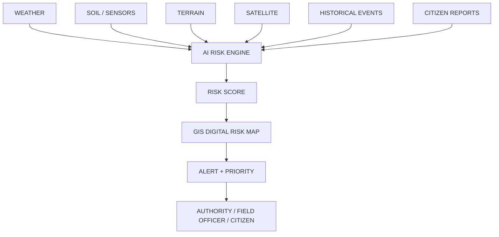

# PRITHVIALERT
## AI-Powered Early Warning & Landslide Risk Monitoring System for NER
**SIH26001**

*From rainfall and terrain signals to actionable early warning.*

> [!NOTE]
> *(Visual: Full-screen screenshot of the PrithviAlert GIS Dashboard showing active risk zones and heatmap)*

---

# THE PROBLEM
**DATA EXISTS but DECISION SUPPORT IS FRAGMENTED.**

- NER is highly vulnerable to landslides and slope failures.
- Heavy rainfall can rapidly destabilize vulnerable slopes.
- Road blockages can isolate remote communities.
- Environmental monitoring exists, but is often fragmented.
- Authorities need location-specific decision support.
- Remote locations frequently face poor network connectivity.

---

# OUR SOLUTION
**One platform transforms heterogeneous hazard signals into location-specific decision support.**

---

# HOW PRITHVIALERT WORKS
**End-to-End Workflow**

1. **Collect** → 2. **Validate** → 3. **Fuse** → 4. **Predict** → 5. **Visualize** → 6. **Alert** → 7. **Verify** → 8. **Update**

**Example Scenario:**
Heavy rainfall → soil saturation increases → vulnerable slope identified → AI risk increases → GIS zone becomes high-risk → nearby road/village identified → authority alerted → field report confirms condition.

---

# AI / ML ENGINE
**Probabilistic Decision Support**

**Models Ensembled:** XGBoost + Random Forest

**Key Features Extracted:**
- Rainfall intensity & accumulation
- Soil moisture
- Slope & Elevation (Terrain)
- Vegetation cover
- Historical susceptibility & Ground movement
- Exposure

**Output:**
Landslide-risk estimate + Categorical Risk Level
*(LOW → MODERATE → HIGH → VERY HIGH → CRITICAL)*

> [!WARNING]
> *Prototype model evaluation — requires validation with verified regional historical observations before operational deployment.*

---

# GIS DIGITAL RISK TWIN
**A Dynamic Operational View of Risk**

> [!NOTE]
> *(Visual: Screenshot of the GIS dashboard highlighting risk zones, heatmaps, and alerts)*

**Highlights:**
- Real-time Risk Zones & Heatmaps
- Overlaid Infrastructure (Roads, Villages)
- Active Sensor Locations
- Live Field Reports & Alerts

Every monitored location continuously combines its environmental state, terrain susceptibility, and exposure to generate this dynamic view.

---

# REAL-TIME EARLY WARNING
**Proximity-Based Alerting via WebSocket + GPS + PostGIS**

**Workflow:**
USER LOCATION → ST_DWithin (PostGIS) → NEARBY RISK ZONE → PROXIMITY ALERT

**Dynamic Transitions:**
NORMAL → HEAVY RAIN → SLOPE INSTABILITY → CRITICAL

*The dashboard and alerts change dynamically as environmental thresholds escalate.*

---

# CITIZEN + FIELD INTELLIGENCE
**Human-in-the-loop Verification**

AI-generated risk is strengthened by field observations, while authorities remain responsible for final decisions.

**Field Report Data:**
GPS Location + Photo + Hazard Type (crack, rockfall, etc.) + Severity + Timestamp

**Workflow:**
AI → Authority Review → Field Verification → Action

---

# EMERGENCY PRIORITIZATION
**"Where should authorities look first?"**

**PRIORITY SCORE = RISK × POPULATION EXPOSURE × INFRASTRUCTURE IMPORTANCE × CONNECTIVITY IMPACT**

**Examples:**
- **CRITICAL ZONE A** → HIGH RESPONSE PRIORITY
- **VERY HIGH ZONE B** → FIELD INSPECTION
- **HIGH ZONE C** → MONITORING

The platform does not just indicate *where* risk exists; it helps prioritize the response.

---

# IMPACT + ROADMAP
**From fragmented signals to actionable early warning.**

**CURRENT PROTOTYPE:**
- ✅ AI risk engine & ML model integration
- ✅ GIS dashboard with PostGIS spatial intelligence
- ✅ Real-time proximity alerts (WebSocket)
- ✅ Demo scenario engine & Citizen/field reporting
- ✅ Docker deployment

**NEXT STEPS FOR DEPLOYMENT:**
Verified NER historical datasets → Real weather integration → Real DEM/soil/satellite feeds → Regional calibration → IoT sensor integration → District deployment → NER-wide disaster intelligence platform
